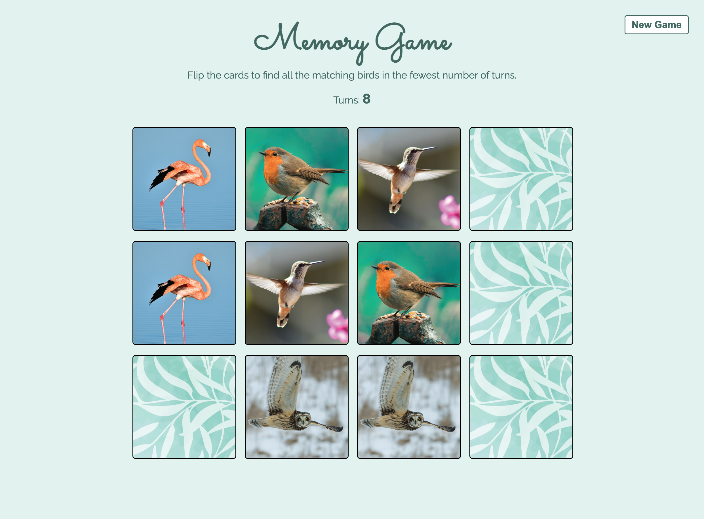

# Memory Game

## Badges

## Description
A simple 'flip the cards' memory game built using React

## Table of Contents
- [How to Play](#how-to-play)
- [License](#license)
- [Questions](#questions)

## How to Play
Flip the cards to find all the matching birds in the fewest number of turns.

## License
All assets and code are under MIT License unless specified otherwise.

## Questions
Any questions? Visit my GitHub profile at [https://github.com/katyjmt](https://github.com/katyjmt) or email me at [katyjmt@gmail.com](katyjmt@gmail.com).